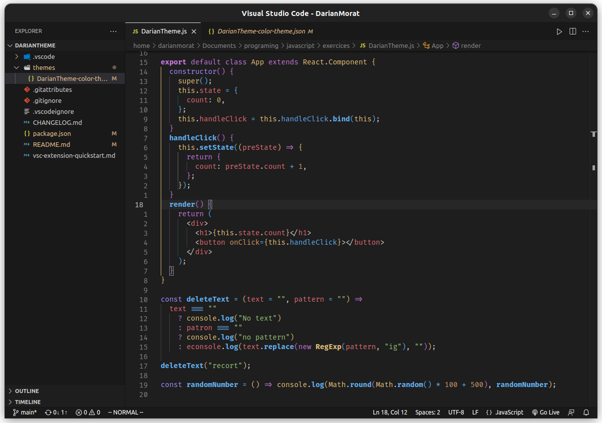

# DarianTheme


&nbsp;

You can remove the BOLD functions by adding this in your settings.json:

```
"editor.tokenColorCustomizations": {
    "[DarianTheme]": {
      "textMateRules": [
        {
          "scope": [
            "keyword.control.export.js",
            "keyword.control.import.js",
            "keyword.control.from.js",
            "entity.name.function.js",
            "support.function.js",
            "support.function.math.js"
          ],
          "settings": {
            "fontStyle": ""
          }
        }
      ]
    }
  }
```

<!-- To do again the extension this time with all the configurations done one time -->
